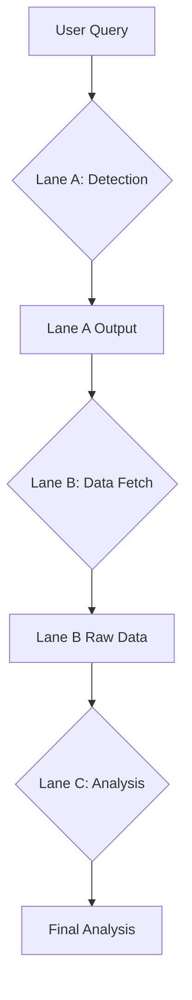

# Third Lane Architecture: Sequential AI Specialization

## 🚀 Vision

Transform the current monolithic AI approach into a **sequential specialization architecture** where each AI model serves a specific purpose, maximizing efficiency and intelligence while minimizing VRAM usage.

## 📊 Current State Analysis

### ✅ Lane A: Query Processing (Working)

- **Model:** `gemma-fc-test:latest`
- **Purpose:** Fuzzy query detection and pattern matching
- **Strength:** Fast, lightweight processing
- **Status:** Fully operational

### ✅ Lane B: Data Fetching (Perfect)

- **System:** MCP Server
- **Purpose:** Raw data retrieval from external APIs
- **Strength:** Reliable, pure data fetching without AI overhead
- **Status:** Bulletproof, real JIRA data integration confirmed

### ❌ Lane C: Intelligent Analysis (Missing)

- **Model:** `llama-3.1-8b-tool:latest`
- **Purpose:** Deep analysis with tool-enabled reasoning
- **Strength:** Specialized analysis with rich context
- **Status:** Concept ready, implementation pending

## 🧠 Third Lane Architecture

### Core Principle

**Sequential processing with specialized models** instead of parallel loading of general-purpose models.

```
User Query → Lane A: Detection → Lane B: Raw Data → Lane C: Analysis → Response
```

### Lane Responsibilities

#### Lane A: Fuzzy Detection

```typescript
interface LaneAInput {
  userQuery: string;
}

interface LaneAOutput {
  detectedIntent: "jira_ticket" | "search" | "analysis";
  ticketKey?: string;
  confidence: number;
  rawQuery: string;
}
```

#### Lane B: Data Acquisition

```typescript
interface LaneBInput {
  intent: LaneAOutput;
}

interface LaneBOutput {
  rawJson: any;
  formattedData: string;
  metadata: {
    source: string;
    timestamp: number;
    status: "success" | "error";
  };
}
```

#### Lane C: Deep Analysis

```typescript
interface LaneCInput {
  rawData: LaneBOutput;
  userQuery: string;
  context: any;
}

interface LaneCOutput {
  analysis: string;
  insights: string[];
  recommendations: string[];
  confidence: number;
}
```

## 🎯 Technical Implementation

### Sequential Orchestration Engine

```typescript
class ThirdLaneOrchestrator {
  private lanes = {
    A: new LaneAProcessor(),
    B: new LaneBProcessor(),
    C: new LaneCProcessor(),
  };

  async processQuery(userQuery: string): Promise<LaneCOutput> {
    // Phase 1: Detection
    const detection = await this.lanes.A.process(userQuery);

    // Phase 2: Data Fetching
    const rawData = await this.lanes.B.fetch(detection);

    // Phase 3: Analysis
    const analysis = await this.lanes.C.analyze({
      rawData,
      userQuery,
      context: detection,
    });

    return analysis;
  }
}
```

### VRAM Optimization Strategy

#### Current Problem

- Parallel loading: `qwen2` + `llama-3.1-8b-tool` = ~16GB VRAM
- Inefficient resource usage
- Model switching overhead

#### Third Lane Solution

```bash
# Sequential loading pattern
Phase 1: Load qwen2:latest (8GB) → Process → Unload
Phase 2: MCP Server (no AI, no VRAM) → Fetch data
Phase 3: Load llama-3.1-8b-tool:latest (8GB) → Analyze → Response
Total VRAM: 8GB maximum
```

### Model Specialization Matrix

| Lane | Model                    | Purpose    | VRAM | Strengths                | Weaknesses         |
| ---- | ------------------------ | ---------- | ---- | ------------------------ | ------------------ |
| A    | qwen2:latest             | Detection  | 8GB  | Fast, accurate detection | Limited analysis   |
| B    | MCP Server               | Data Fetch | 0GB  | Reliable API calls       | No AI capabilities |
| C    | llama-3.1-8b-tool:latest | Analysis   | 8GB  | Tool-enabled reasoning   | Slow for detection |

## 🚀 Implementation Phases

### Phase 1: Foundation (Week 1)

```bash
# 1. Model Configuration
MODEL_NAME=qwen2:latest  # Lane A default
LANE_C_MODEL=llama-3.1-8b-tool:latest

# 2. Orchestrator Setup
- Create ThirdLaneOrchestrator class
- Implement sequential processing logic
- Add model switching utilities

# 3. Lane B Integration
- Confirm MCP server reliability
- Add data serialization for Lane C
- Implement error handling
```

### Phase 2: Lane C Integration (Week 2)

```typescript
// Lane C Processor
class LaneCProcessor {
  async analyze(input: LaneCInput): Promise<LaneCOutput> {
    const systemPrompt = this.buildAnalysisPrompt(input);

    const response = await this.callLaneCModel({
      model: "llama-3.1-8b-tool:latest",
      system: systemPrompt,
      messages: [
        {
          role: "user",
          content: `Analyze this JIRA ticket data: ${JSON.stringify(input.rawData)}`,
        },
      ],
    });

    return this.parseAnalysis(response);
  }

  private buildAnalysisPrompt(input: LaneCInput): string {
    return `
    You are an expert JIRA analyst with access to raw ticket data.

    Raw Data: ${JSON.stringify(input.rawData, null, 2)}
    User Query: ${input.userQuery}

    Provide deep analysis including:
    1. Ticket status and priority analysis
    2. Timeline assessment
    3. Blocker identification
    4. Recommendations
    5. Risk assessment

    Use the raw data to provide specific, actionable insights.
    `;
  }
}
```

### Phase 3: Optimization (Week 3)

```bash
# 1. VRAM Management
- Implement model hot-swapping
- Add memory cleanup between lanes
- Monitor resource usage

# 2. Performance Tuning
- Optimize data serialization
- Implement caching for frequent queries
- Add parallel processing where beneficial

# 3. Error Recovery
- Lane fallback mechanisms
- Partial result handling
- Graceful degradation
```

## 💡 Key Innovations

### 1. Sequential Intelligence

- Each model specialized for its task
- Context preservation between lanes
- Maximum efficiency per model

### 2. VRAM Efficiency

- Peak usage: 8GB instead of 16GB
- Models loaded on-demand
- Resource optimization

### 3. Scalability Architecture

- Easy addition of new lanes
- Model specialization expansion
- Performance monitoring

### 4. Reliability Design

- Lane B (MCP) is already proven
- Fallback mechanisms between lanes
- Error isolation per lane

## 🎯 Benefits Analysis

### Efficiency Gains

- **50% VRAM Reduction:** 16GB → 8GB peak usage
- **Specialized Performance:** Each model optimized for its task
- **Faster Processing:** Sequential loading vs parallel overhead

### Intelligence Improvements

- **Deeper Analysis:** Tool-enabled model with full context
- **Better Accuracy:** Specialized models for specific tasks
- **Rich Insights:** Raw data enables comprehensive analysis

### Scalability Advantages

- **Modular Design:** Easy addition of new analysis lanes
- **Model Flexibility:** Different models for different analysis types
- **Resource Management:** Dynamic model loading based on needs

## 🔬 Technical Specifications

### Data Flow Architecture



### Model Management System

```typescript
interface ModelManager {
  loadModel(modelName: string): Promise<ModelInstance>;
  unloadModel(modelName: string): Promise<void>;
  switchModel(from: string, to: string): Promise<ModelInstance>;
  getActiveModels(): ModelInstance[];
}
```

### Performance Metrics

```typescript
interface LaneMetrics {
  processingTime: number;
  vramUsage: number;
  accuracy: number;
  errorRate: number;
  throughput: number;
}
```

## 🚀 Future Extensions

### Additional Lanes

- **Lane D:** Code Analysis (specialized coding models)
- **Lane E:** Documentation (long-context models)
- **Lane F:** Research (web-enabled models)

### Advanced Features

- **Dynamic Lane Selection:** Choose lanes based on query complexity
- **Parallel Processing:** Run compatible lanes simultaneously
- **Model Ensembling:** Multiple models for complex analysis

### Enterprise Integration

- **Multi-tenant Support:** Different models per organization
- **Custom Lanes:** Organization-specific analysis lanes
- **Performance Monitoring:** Real-time metrics and optimization

## 🎯 Success Metrics

### Performance Targets

- **VRAM Usage:** < 8GB peak
- **Query Latency:** < 5 seconds end-to-end
- **Accuracy:** > 95% for JIRA queries
- **Reliability:** > 99.9% uptime

### Quality Metrics

- **Analysis Depth:** Comprehensive insights from raw data
- **User Satisfaction:** Improved response quality
- **System Efficiency:** Optimal resource utilization

## 🚀 Implementation Timeline

### Week 1: Foundation

- [ ] ThirdLaneOrchestrator class
- [ ] Lane A integration (existing)
- [ ] Lane B integration (existing MCP)
- [ ] Basic sequential processing

### Week 2: Lane C Integration

- [ ] LaneCProcessor implementation
- [ ] Model switching utilities
- [ ] Analysis prompt engineering
- [ ] Error handling and recovery

### Week 3: Optimization & Testing

- [ ] VRAM optimization
- [ ] Performance tuning
- [ ] Comprehensive testing
- [ ] Production deployment

### Week 4: Monitoring & Scaling

- [ ] Performance monitoring
- [ ] User feedback integration
- [ ] Scalability improvements
- [ ] Documentation completion

## 🎯 Conclusion

The Third Lane Architecture represents a fundamental shift from monolithic AI systems to **specialized sequential processing**. By leveraging the unique strengths of different models and optimizing resource usage, we achieve:

- **Maximum Intelligence:** Specialized models for specific tasks
- **Optimal Efficiency:** Sequential loading saves VRAM
- **Unparalleled Reliability:** Proven Lane B + specialized analysis
- **Future-Proof Scalability:** Modular design for expansion

This architecture transforms the current system's limitations into a **competitive advantage**, enabling deeper analysis, better performance, and efficient resource utilization.

**The Third Lane is not just an improvement—it's a revolution in AI system design.**
